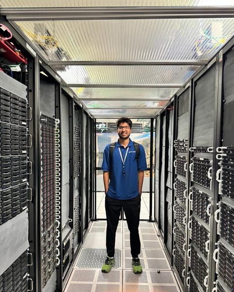
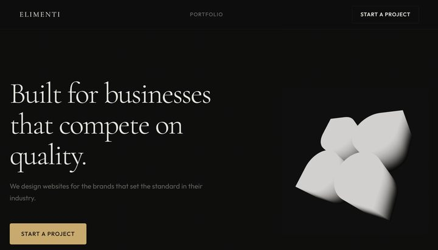
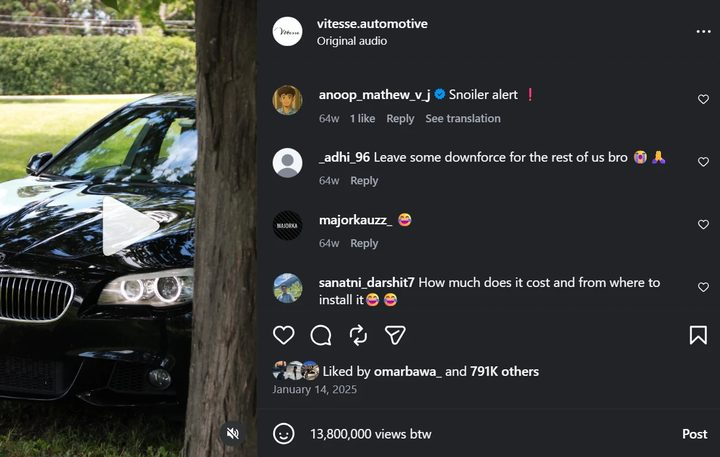
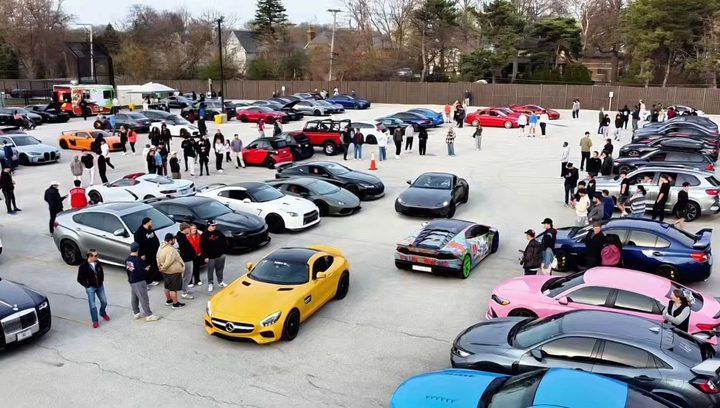

# Hashim Hassan

Mechanical Engineering at UIUC. Founder of Elimenti Web Studio.

I'm a freshman from the western Chicago suburbs. I'm currently scaling Elimenti Web Studio. This past summer I was an AI Research Intern at Fermilab, working on a project to decrease hallucinations in LLMs.

## Now

*Updated September 2026*

- Looking for an internship or co-op at an early-stage startup.
- First semester at UIUC, which includes learning CAD in Fusion 360.
- Building custom sites for local businesses at [Elimenti](https://elimenti.com).
- On the Community Team at Founders: Illinois Entrepreneurs.
- Doing creative direction for [Burdi Clothing](https://www.instagram.com/burdiclothing) in Hinsdale, IL.
- Planning to apply to the Hoeft Technology & Management minor.

## Work

### Limiting AI Hallucinations with Semantic Knowledge Graphs

**Fermilab** · Summer 2026 · AI Research Intern

Our team modeled the MI-8 target and the CMS detector in OML, then gave an LLM tools to query them with SPARQL.

**My part: I wrote custom benchmark tests, since models often train on public benchmarks, and wrote OML vocabularies for our models.**

[Project slides (PDF, cleared by Fermilab for public release)](fermilab-slides.pdf)

### Elimenti

**Web design studio** · 2026–now · Founder

I build custom-coded static websites for local businesses, focusing on quality and design. I also maintain existing sites for others.

Already at 3 paying clients and 1 pro bono build.

[elimenti.com](https://elimenti.com)

### Vitesse

**Automotive media and clothing** · 2024–2025 · Founder

I started an automotive media brand that also sold clothing.

Over 20,000,000 organic views on Instagram.

[@vitesse.automotive](https://www.instagram.com/vitesse.automotive/)

### Red Devils Garage

**Car club** · 2024–2025 · Co-founder

I co-founded a 60+ member car club and organized a charity car meet to raise money for [HCS Family Services](https://www.hcsfamilyservices.org/).

We had over 200 cars at the meet, and we raised over $10,000.

[@reddevilsgarage](https://www.instagram.com/reddevilsgarage/)

## Background

- **2026–now** · B.S. Mechanical Engineering, The Grainger College of Engineering, UIUC (class of 2030). First-year student with Sophomore standing. Started with 53 credits from AP exams.
- **Summer 2026** · AI Research Intern, Fermilab
- **2026** · Started Step One Sites, renamed it Elimenti in April
- **2024–now** · Creative direction, Burdi Clothing, Hinsdale. Took over maintaining their website in 2025.
- **Summer 2024** · Research and design intern, Northwestern University Transplant Center

## Outside of work

I ran cross country and track throughout high school and raced more than 120 times. My best mile was a 4:57. I also sim race in Gran Turismo 7 and follow motorsport. Big car guy (I love Ferrari and Aston Martin).

## Contact

Email is the fastest way to reach me: [hashim.hassan.us@gmail.com](mailto:hashim.hassan.us@gmail.com)

[LinkedIn](https://www.linkedin.com/in/hashimhassan/) · [Instagram](https://www.instagram.com/hashimh6ssan) · [Elimenti](https://elimenti.com) · [Resume](resume.pdf)

## My Guide to Virality

Code box. Entering the right code sends you to /virality/ (virality/index.html).

---

© 2026 Hashim Hassan. Last updated September 2026.

